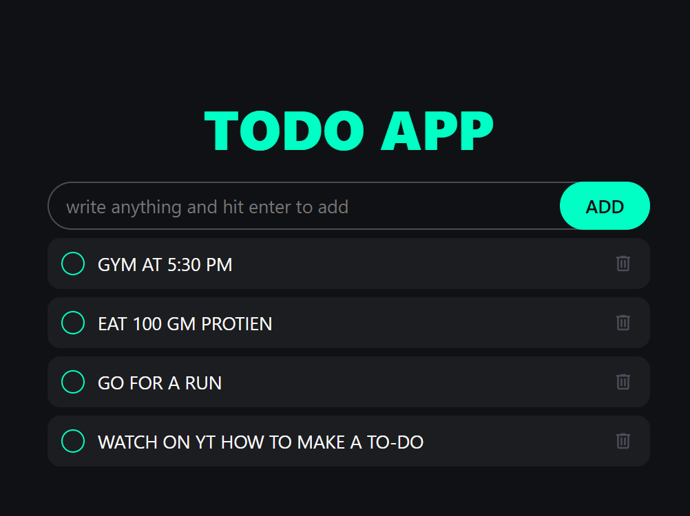

# 📝 To-Do List Web App

A simple and stylish **To-Do List App** built with **HTML, CSS, and JavaScript**.  
This app allows users to **add, mark complete, and delete** tasks with a clean and modern UI.

## 🌟 Features

✅ Add new tasks easily  
✅ Mark tasks as completed  
✅ Delete tasks with a single click  
✅ Responsive and dark theme UI  
✅ Smooth animations  

## 🚀 Technologies Used

- **HTML** for structure  
- **CSS** for styling  
- **JavaScript** for functionality  

## 🔧 How to Use

1. Type your task in the input field.  
2. Press "Enter" or click the **ADD** button to add a new task.  
3. Click on the circle to mark a task as completed.  
4. Click the **trash icon** to delete a task.  
